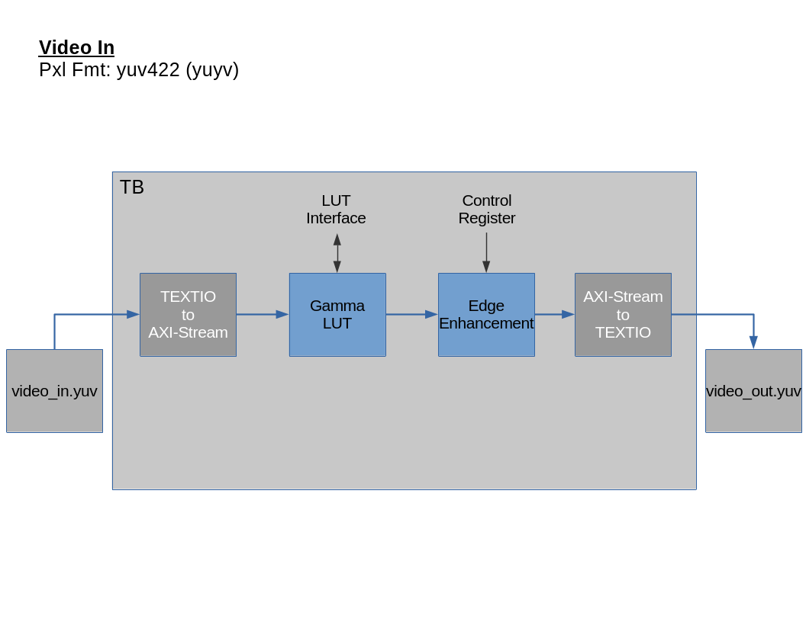
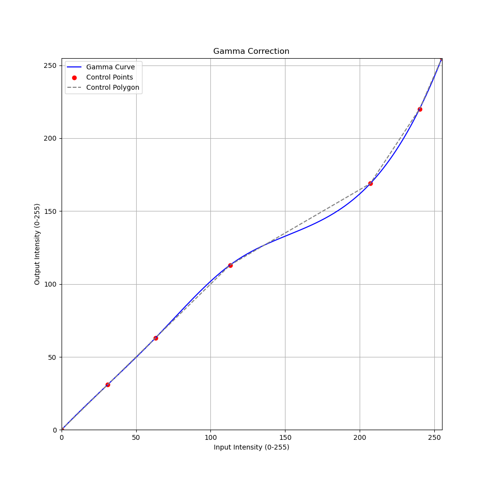

# FPGA Image Enhancement

### Directories:
The following is a description of directories:
+ docs : Documents folder
+ rtl  : RTL Logic
+ tb   : Testbench
+ scripts: testbench scripts
+ sim  : Modelsim and verification files
+ video: Contains samples of video used as stimulus
+ c\_model: cpp module

### Prerequisites
The following are list of tools required to run the project

+ Modelsim 2021.1
+ Vivado 2020.1
+ FFplay
+ FFmpeg
+ OpenCV
+ Make
+ Cmake

Generate vivado simulation libraries for modelsim and install in ````/opt/xilinx_sim_lib/```` directory.

## Getting Started

### Cpp Model
The following are the steps to compile the opencv model:
1) Navigate to c\_model
2) Run cmake command: ````cmake .````
3) Run make command: ````make````
4) Execute program: ````./esharp -i foreman_128x144.yuv -s 128x144 -g 1.4````


### Modelsim Simulation
Running the simulation:

1) Clean and setup the directory (```` make clean setup ````)
2) Run the simulation (```` make sim ````)
3) Play the output video (```make play```)

You can also display the waveform by running ```` make waves ```` or run in GUI mode using the command ```` make sim GUI=1 ````

### Testbench Architecture

The video is converted to text file and fed through the modules using AXI-Stream interface.




### Gamma Correction Curve

In this example the intensity of brighter pixels is reduced to increase the contrast in the image. the figure below shows the curve used in the LUT.

Gamma LUT:



### Sharpening Kernel

The following kernel matrix is used to sharpen the image:

$$
Kernel = 
\begin{bmatrix}
0 & -1 & 0 \\
-1 & 5 & -1 \\
0 & -1 & 0
\end{bmatrix}
$$

### NOTES:

Using FFplay to play raw video:
```console
ffplay -f rawvideo -pixel_format yuyv422 -video_size 128x144 -i foreman_128x144.yuv
```
